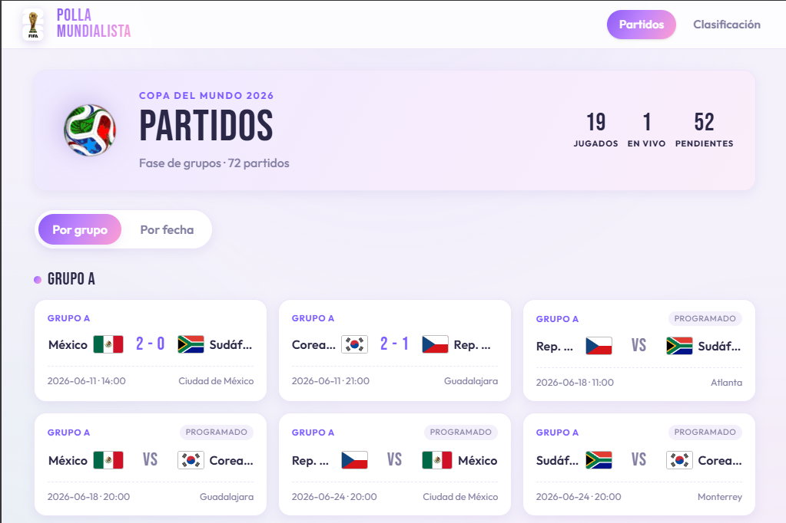

# Polla Mundialista 2026



Web app de quiniela para la fase de grupos del Mundial 2026. Muestra la tabla de posiciones en tiempo real, el detalle de predicciones por participante y el resumen de cada partido.

## Stack

- [Astro 6](https://astro.build/) — generación estática con TypeScript estricto
- `pnpm` como gestor de paquetes
- Node >= 22.12.0 (los tests corren sobre TypeScript nativo vía `node:test`)

## Comandos

```bash
pnpm install    # instalar dependencias
pnpm dev        # servidor de desarrollo en localhost:4321
pnpm build      # build de producción → dist/
pnpm preview    # sirve el dist/ construido
pnpm test       # ejecuta todos los *.test.ts
```

Correr un solo archivo de test o filtrar por nombre:

```bash
node --test src/lib/scoring.test.ts
node --test --test-name-pattern="marcador exacto" "src/**/*.test.ts"
```

## Estructura

```
src/
  pages/
    index.astro              # home / tabla de posiciones
    clasificacion.astro      # clasificación general
    participante/[id].astro  # detalle de un participante
    partido/[id].astro       # detalle de un partido
  layouts/                   # shells HTML con <slot />
  components/                # componentes .astro reutilizables
  data/
    matches.ts               # 72 partidos de fase de grupos (2026)
    participants.ts           # participantes con sus 72 predicciones
    teamFlags.ts             # mapeo equipo → bandera
    Prueba.xlsx              # fuente original de predicciones (no editar)
  lib/
    scoring.ts               # lógica de puntaje (pura, testeable)
    scoring.test.ts
    views.ts                 # helpers de presentación sin Astro
    views.test.ts
    matchSource.ts           # integración con fuente de resultados en vivo
    sportsdb.ts              # cliente TheSportsDB
```

## Sistema de puntos

| Situación | Puntos |
|---|---|
| Marcador exacto (ambos goles) | 5 |
| Resultado correcto (ganador o empate) | +2 |
| Goles de al menos un equipo acertados | +1 |

Los bonos de resultado y goles son independientes — cuando no hay exacto se pueden sumar 0 / 1 / 2 / 3 puntos. Solo se puntúan partidos con resultado registrado (`result !== null`).

## Datos

- `matches.ts` — fuente de verdad de partidos y resultados; `result: null` = partido no jugado.
- `participants.ts` — generado desde `Prueba.xlsx` (hoja "Polla - Grupos"); no editar a mano.
- Los resultados en vivo se obtienen vía TheSportsDB (`src/lib/sportsdb.ts`).
